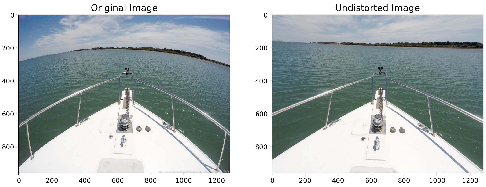

## Camera Calibration

This project contains camera calibration and undistortion functionality using Python 3 and OpenCV 3. Given
a set of chessboard images, this project computes the camera matrix and distortion coefficients of the camera 
used to capture the chessboard dataset. Run the example code like so:

    python calibrate.py