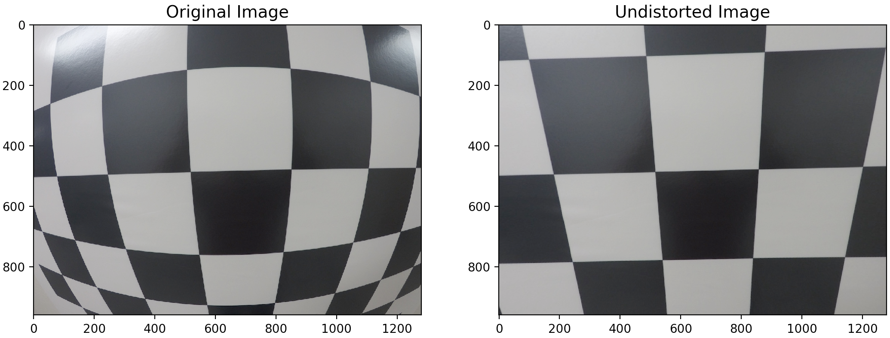

## Camera Calibration
### Abstract
This project contains camera calibration and undistortion functionality using Python 3 and OpenCV 3. Given
a set of chessboard images, this project computes the camera's matrix and distortion coefficients. Afterward,
the project uses the camera matrix and distortion coefficients to undistort other images captured by the same camera.
Always remember: "straight lines should be straight." ;)

### Usage
Download the example dataset:

    wget -O datasets.zip "https://www.dropbox.com/s/bo2wsm2e068c3az/datasets.zip?dl=1"
    unzip datasets.zip
    
Run the example code:

    python calibrate.py
